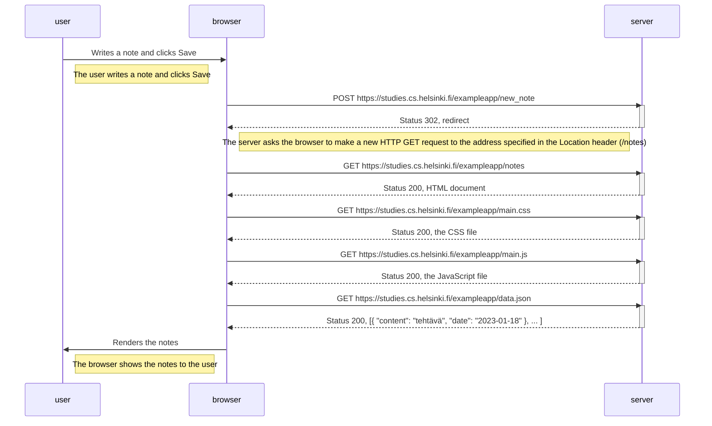

```mermaid
sequenceDiagram
    participant user
    participant browser
    participant server

    user->>browser: Writes a note and clicks Save
    Note right of user: The user writes a note and clicks Save

    browser->>server: POST https://studies.cs.helsinki.fi/exampleapp/new_note
    activate server
    server-->>browser: Status 302, redirect
    deactivate server
    Note right of browser: The server asks the browser to make a new HTTP GET request to the address specified in the Location header (/notes)

    browser->>server: GET https://studies.cs.helsinki.fi/exampleapp/notes
    activate server
    server-->>browser: Status 200, HTML document
    deactivate server

    browser->>server: GET https://studies.cs.helsinki.fi/exampleapp/main.css
    activate server
    server-->>browser: Status 200, the CSS file
    deactivate server

    browser->>server: GET https://studies.cs.helsinki.fi/exampleapp/main.js
    activate server
    server-->>browser: Status 200, the JavaScript file
    deactivate server

    browser->>server: GET https://studies.cs.helsinki.fi/exampleapp/data.json
    activate server
    server-->>browser: Status 200, [{ "content": "tehtävä", "date": "2023-01-18" }, ... ]
    deactivate server

    browser->>user: Renders the notes
    Note right of user: The browser shows the notes to the user
```