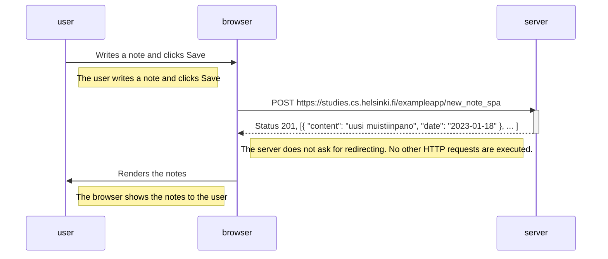

```mermaid
sequenceDiagram
    participant user
    participant browser
    participant server

    user->>browser: Writes a note and clicks Save
    Note right of user: The user writes a note and clicks Save

    browser->>server: POST https://studies.cs.helsinki.fi/exampleapp/new_note_spa
    activate server
    server-->>browser: Status 201, [{ "content": "uusi muistiinpano", "date": "2023-01-18" }, ... ]
    deactivate server

    Note right of browser: The server does not ask for redirecting. No other HTTP requests are executed.

    browser->>user: Renders the notes
    Note right of user: The browser shows the notes to the user
```